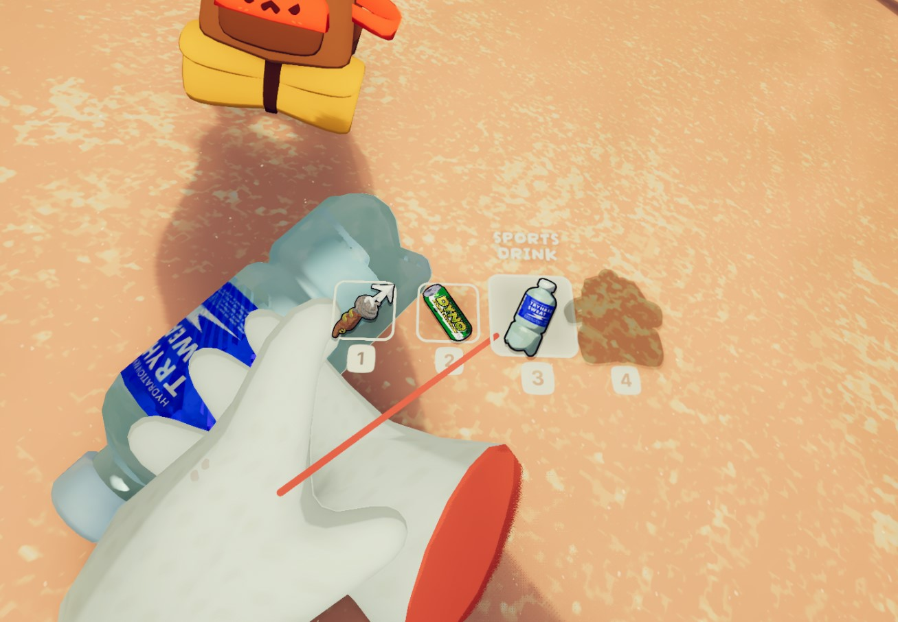
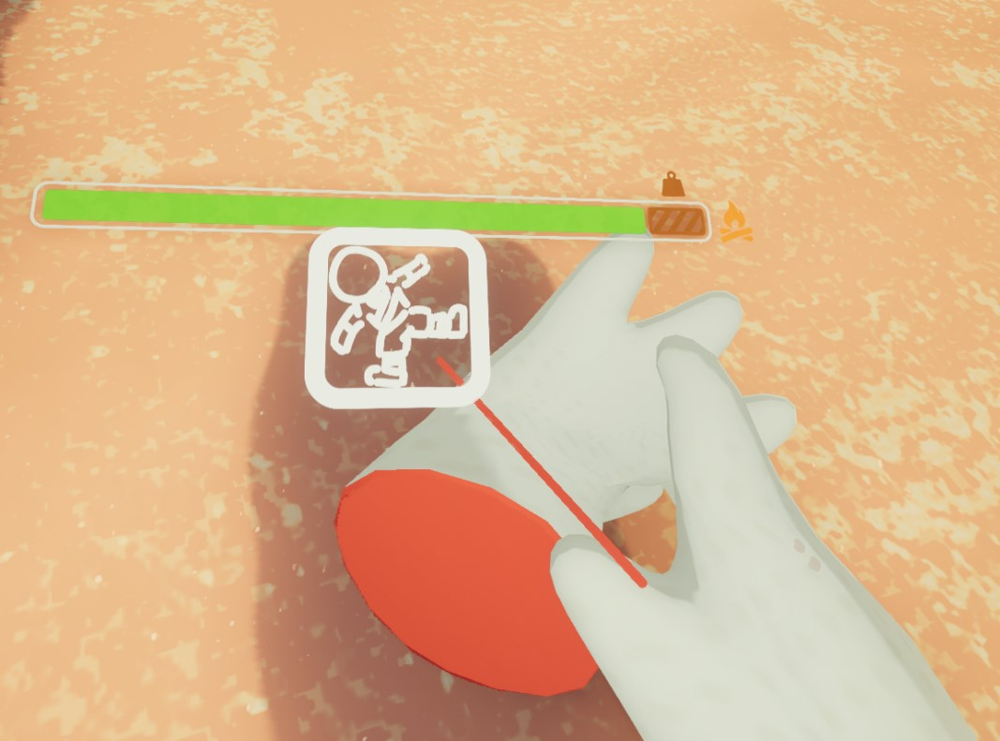

<p align="center">
  
</p>

PeakVR is a mod that adds full 6DOF VR support into PEAK.

This mod, as the Lethal Company VR mod, is powered by Unity's OpenXR plugin, and is thereby compatible with a wide range of headsets and runtimes, like Oculus, Virtual Desktop, SteamVR and many more!

It brings your head and hands into VR with motion controls, but it does **not** add physical, hand-over-hand climbing — you still climb the way the base game does (hold the grab button on a handhold). Don't expect a climbing simulator.

Forked from [LCVR](https://github.com/DaXcess/LCVR) by DaXcess.

# Usage

Install PeakVR with a mod manager (such as [r2modman](https://thunderstore.io/c/peak/p/ebkr/r2modman/), Gale, or the Thunderstore Mod Manager) from the [Thunderstore page](https://thunderstore.io/c/peak/p/Andrey04o/PeakVR/) — dependencies are installed automatically.

Running the mod using r2modman can be done simply by clicking "Start Modded", which will automatically launch the game with the installed mods.

Tested with PEAK **1.64.a** (stable) and **0.65.d** (beta).

# Controls

| Control | Action |
| --- | --- |
| Left stick | Move |
| Left stick (click) | Sprint |
| Right stick (left / right) | Turn (snap or smooth) |
| Right stick (up / down) | Scroll (rope length, cannon angle, guidebook pages) |
| Right stick (click) | Ping |
| Right grip | Interact / grab  |
| Left grip | Drop the held item |
| Right trigger | Primary action / climb |
| Left trigger | Secondary action |
| A (right) | Jump |
| B (right) | Hold / holster the item |
| X (left) | Crouch |
| Y (left) | Pause menu |


| Select an item slot | Open the emote wheel |
| --- | --- |
|  |  |

The rest of this README only outlines how to build and install the mod manually from source.

# Building from source

## Build

Requires the [.NET SDK](https://dotnet.microsoft.com/download) 8.0 or newer and PEAK installed (the build references the game's assemblies).

```sh
git clone https://github.com/Andrey04o/PeakVR.git
cd PeakVR
dotnet build
```

This compiles the plugin and copies `com.andrey04o.PeakVR.dll` into the game's `BepInEx/plugins/` folder. 

If PEAK isn't at the default Steam path, copy `Config.Build.user.props.template` to `Config.Build.user.props` and set `PeakGameRootDir` / `PeakPluginsDir`.

The preloader (`LCVR.Preload.dll`) is built alongside the plugin and belongs in `BepInEx/patchers/`.

## Asset bundle

The plugin loads a `peakvr` asset bundle that is not included in this repository. Build it from the companion Unity project at [PeakVR-Assets](https://github.com/Andrey04o/PeakVR-Assets): open the project and run **`Assets/Build PeakVR AssetBundle`** from the menu bar.

## Runtime dependencies

The plugin needs a `RuntimeDeps` folder containing the Unity XR managed assemblies, which are also not included in the repository. You can extract them from the [Thunderstore package](https://thunderstore.io/c/peak/p/Andrey04o/PeakVR/), or retrieve them from a Unity project yourself (see below). For a manual install, place the `RuntimeDeps` folder next to the plugin DLL in `BepInEx/plugins/`.

### Retrieving Runtime Dependencies from a Unity Project

> You can skip this part if you have taken the runtime dependencies from the Thunderstore package.

First install Unity 6000.0.62f1, which is the Unity version that PEAK uses. Once you have the editor, create a new project. Then install these packages:

- OpenXR Plugin
- XR Core Utilities
- XR Interaction Toolkit

You can now build the dummy game. Make sure the scripting backend is set to Mono, not IL2CPP. Once it is built, navigate to its `<Project Name>_Data/Managed` directory and extract the following files into your `RuntimeDeps` folder:

- UnityEngine.SpatialTracking.dll
- Unity.XR.CoreUtils.dll
- Unity.XR.Interaction.Toolkit.dll
- Unity.XR.Management.dll
- Unity.XR.OpenXR.dll

## Thunderstore packaging

Uses [TCLI](https://github.com/thunderstore-io/thunderstore-cli):


It also copying the `RuntimeDeps` and `Bundles` folders into the packge:

```sh
dotnet tool restore
dotnet build -c Release -target:PackTS -v d
```

The package is written to `artifacts/thunderstore/`.

## Debug keys

Launch the game with the `-vr-debugbuttons` argument to enable developer hotkeys.
